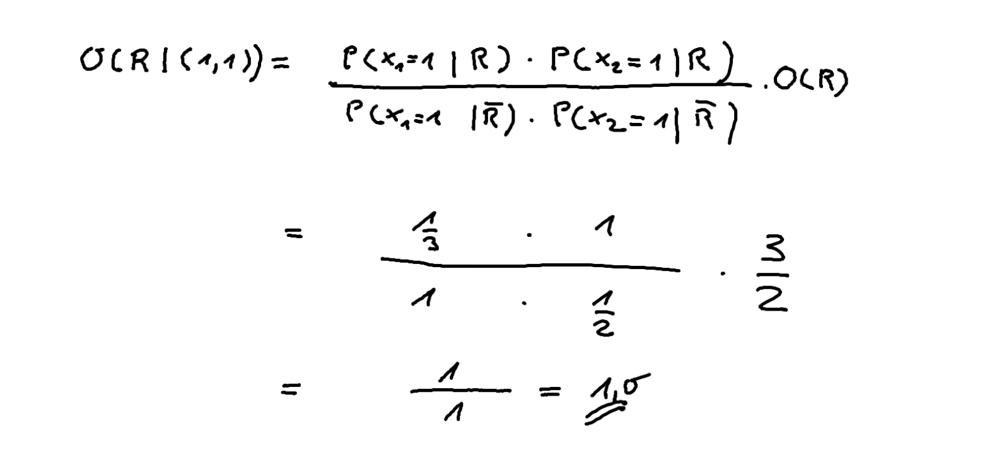

---
titlepage: true
titlepage-color: "ffffff"
titlepage-rule-color: "ffffff"
titlepage-text-color: "000000"
toc-own-page: true
colorlinks: false
title: Zusammenfassung Artificial Intelligence Machine Learning
author:
  - Yannick Hutter
lang: de
date: "17.02.2024"
lof: true
toc: true
mainfont: SF Pro Display 
sansfont: SF Pro Display
monofont: JetBrainsMono Nerd Font 
header-left: "\\small \\thetitle"
header-center: "\\small \\leftmark"
header-right: "\\small \\theauthor"
footer-left: "\\leftmark"
footer-center: ""
footer-right: "\\small Seite \\thepage"
...

\newpage

# Mögliche Prüfungsfragen

> Was ist der Unterschied zwischen Generativen und Diskriminativen Modellen?

**Diskriminative Modelle** geben Entscheidungsgrenzen voro, um die Daten zu unterscheiden:

- Entscheidungsbaum
- Support Vector Machine (SVM)
- Logistische Regression

Der Vorteil von diskriminativen Modellen besteht darin, dass sie einfach in der Anwendung sind und wenig Rechenzeit benötigen.

**Generative Modelle** versucht die Daten anhand statistischer Werte wie Durchschnitt, Varianz etc. zu beschreiben:

- k-Means
- Naive Bayes

Der Vorteil von generativen Modellen ist es, dass auf unbekannten Daten Ausreisser leicht erkennbar sind.

> Warum sind Redundanzen oder Abhängigkeiten beim One-Hot-Encoding böse?

Wenn Redundanzen bestehen, sind die Gleichungssysteme uneindeutig, so können plötzlich beliebig viele Modelle entstehen. Sprich bei Redundanzen gibt es mindestens mehr als eine Lösung und im schlechtesten Fall unendlich viele "beste" Lösungen.


# ETL Pipeline 

Daten sind durch einen **ETL Pipeline** (Extract-Transform-Load) entsprechend gecleant und vorverarbeitet worden. Auf Basis dieser Daten soll ein Modell geschaffen werden, welches zukünftige Daten aufgrund der zur Verfügung stehenden Datenmenge vorhersagen kann.

Beispiele für **Transform-Operationen** sind beispielsweise:

- Filter
- Integration
- Differentiation
- Multiply
- Split
- Concatenating / Joining etc.

# Problemstellungen für Machine Learning
Folgende Problemtypen sind potenzielle Kandidaten für Machine Learning:

- Regression - Formel der Geraden
- Klassifizierung - Weisst Daten aufgrund von vordefinierten Regeln (bspw. `x < 6`) bestimmten Klassen zu
- Clustering
- Natural Language Processing
- Reinforcement Learning

# Regression
Die Regression beschreibt eine Gerade, welche aufgrund einer bestehenden Datengrundlage die Punkte möglichst genau approximiert, d.h. Abstände zwischen den Punkten und der Regressionsgerade sind minimal (d.h. Fehlerquadratsumme ist minimal, sprich die Ableitung sollte 0 sein). Das Modell bei einer Regression ist die **Gerade**
Im 3D Raum ist es keine Gerade mehr sondern eine Fläche, im nD Raum spricht man von einer Hyperebene.

> Achtung: Um bei der Regression ein gutes Ergebnis zu erzielen, sollten die Variablen unabhängig voneinander sein

## One-Hot-Encoding
Die Regression benötigt numerische Daten, damit eine Formel aufgestellt werden kann. Ein beliebtes Verfahren zum Codieren der Daten ist das One-Hot-Encoding. Durch das One-Hot-Encoding entstehen jedoch viele neue Spalten.


### Python Code

```python
get_dummies(df0, columns=["Stadt"])
```

## Autoregression
Es gibt auch noch einen speziellen Vertreter der Regression, mit dem Namen **Autogregression (AR)**. Die Autoregression berücksichtig vorhergehende Werte um auf zukünftige Werte zu schliessen. Dies ist insbesondere für Zeitreihenanalyse interessant.


\begin{align}
    y_{t} &= a * y_{t-1} + b \\ \notag
    y_{t} &= Ergebnis der Regression \\ \notag
    y_{t-1} &= Ergebnis der vorhergehenden Regression \\ \notag
\end{align}

Bei der Autoregression gibt es verschiedene Ordnungen, d.h. wie viele vorletzte Datenpunkte berücksichtig werden:

- Erste Ordnung (1 Datenpunkt zurückschauen): $$y_{t} = a * y_{t-1} + b$$
- Zweite Ordnung (2 Datenpunkte zurückschauen): $$y_{t} = a_{1} * y_{t-1} + a_{2} * y_{t-2} + b$$

Auf Basis der Autoregression  sind weitere Verfahren entwickelt worden:

- ARIMA (AutoRegressive, Moving Average) - Saisonale Schwankungen werden erfasst
- SARIMA (Saisonal Autoregressive Moving Average) - Änderung komplizierter saisonaler Schwankungen werden erfasst


## Bestimmtheitsmass 
Die Qualität bei einer Regression kann mittels des Bestimmheitsmass **R2** geprüft werden:

- Wir berechnen den Fehler für ein richtig schlechtes Modell
- R2-Wert besagt, wie gut unser Modell im Vergleich zum richtig schlechten Modell abschneidet

Unter einem richtig schlechten Modell ist ein Modell zu verstehen, welches die Eingabedaten gar nicht beachtet sondern nur auf den Durchschnitt der Daten an sich schaut, d.h. ergibt sich folgende Formel für den R2 Wert (der Teil im Divisor ist das "schlechte Modell"):

\begin{align}
    R^2 = 1 - \frac{\sum_{i=1} (y_{i} - \hat{y}_{i})^2}{\sum_{i=1} (y_{i} - \bar{y})^2}\notag
\end{align}

Der R2 Wert besagt, wie viel der Varianz durch das Modell erklärt wird.

# Datentypen
Grundsätzlich lassen sich Daten in folgende Kategorien einteilen.

**Metrisch**

> Diese Daten können direkt im Machine Learning eingesetzt werden

Die Abstände zwischen den Werten haben eine direkte Bedeutung, Beispiele für metrische Daten sind:

- Zahlen
- Distanz
- Geld

**Ordinal**

> Ordinale Daten sind schwierig für ML vorzubereiten, One-Hot-Encoding resultiert in viel mehr Spalten und umwandeln in Metrische Grössen aufgrund der Rangordnung ist oftmals schwierig und das Modell kann so falsche Strukturen lernen.

Die Abstände zwischen den Werten haben eine unbestimmte Grösse, jedoch gibt es eine Rangordnung, Beispiele für ordinale Daten sind:

- Alterseinteilung von Menschen
- Sportergebnis
- Zeitliche Beschreibungen (Morgens, Mittags, Abends)
- Kleinunternehmen, Mittelstand, Aktiengesellschaft


**Nominal**

> Diese Daten müssen für ML vorab aufbereitet werden, bspw. Informatik = 1, Mathematik = 2 etc.

Es gibt keine Rangordnung, wird verwendet um nicht numerische Eigenschaften zu beschreiben, die zutreffend oder nicht zutreffend sind. Beispiele hierfür sind:

- Geschlecht
- Studienfach

## Python Code

**Umwandlung von Daten** 

```python
np.where(np.array([1, 2, 3, 4, 5, 6]) <= 4, ["bestanden"], ["nicht bestanden"])

```

# Polynomiale Regression
Anstelle von linearen Termen besitzt das Modell über polynomiale Terme.

\begin{align}
    f(x) = ax_{1} + bx_{2} + cx_{1}^2 + dx_{1}x_{2} + ex_{2}^2 + g \notag
\end{align}

Diese werden separat berechnet und anschliessend an eine Lineare Regression übergeben, d.h gelten folgende Schritte:

- Daten
- Polynomiale Terme erstellen
- Lineare Regression

## Überführung polynomiale Regression zu lineare Regression

> Achtung: Es müssen auch die verschiedenen **Kombinationen** der X-Werte als separate Spalten aufgeführt werden

Um eine polynomiale Regression in eine lineare Regression zu überführen, müssen die einzelnen Bestandteile der Gleichung (x1, x2 , x^2 etc.) als separate Spalten betrachtet werden. Die Polynomiale Regression versucht dann die Werte für `a, b, c, d, e` uws. zu "lernen" um später aus einer Kombination von x Werten das korrekte Ergebnis vorhersagen zu können.


# Klassifizierung

> Die Klassifizierung arbeitet mit bekannten (gelabelten) Daten, sie ist daher ein Prinzip des Supervized Learnings

Bei der Klassifizierung geht es darum bestehende Datenpunkte in Gruppen/Klassen anhand eines Kriteriums (bspw. `x=6`) einteilen zu können. Das Modell bei einer Klassifikation ist eine **Trennlinie**. Die Klassifikation ist ein **überwachtes** Lernverfahren

Bei der Klassifizierung gibt es verschiedene Typen der Klassifikation:

- Binäre Klassifizierung - Entweder das Eine oder das Andere
- Nicht binäre Klassifizierung - Was für eine Ziffer wurde geschrieben (bpsw. 1-9 möglich)

## Logistische Regression

> Achtung: Bei der logistischen Regression müssen die Werte um 0 herum verteilt werden, es braucht daher ein Scaling

Die logistische Regression ist ein Verfahren für eine **binäre Klassifizierung**. Sie verlangt daher numerische Daten bspw. 0 = Nein und 1 = Ja.
Als Modell der Logistischen Regression wird oft die **Sigmoid-Funktion** verwendet:

\begin{align}
    f(x) = \frac{1}{1 + e^(-x)}
\end{align}

Die logistische Regression kann eigentlich nur eine **binäre** Unterscheidung treffen, um eine Regression für mehrere Klassen durchzuführen gibt es verschiedene Ansätze:

**One vs. All**

Die Klasse mit dem höchsten Wert gewinnt. Ein Nachteil hierbei ist, dass man so viele Modelle braucht wie es Klassen gibt. Ausserdem muss man immer mit allen vorhandenen Daten trainieren

**One vs. One**

Es gewinnt diejenige Klasse mit den meisten Ergebnissen. Man braucht zwar mehr Modelle, muss diese aber mit weniger Daten füttern.

Kurz zusammengefasst:

- One vs. All - K Modelle
- One vs. One - K * (K-1) / 2 Modelle, geeignet für grosse Datenmengen weil die Modelle jeweils nur Anteile der Daten benötigen

# Clustering
Beim Clustering sollen Daten, die untereinander mehr oder weniger ähnlich sind in Gruppen eingeteilt werden. Das Modell beim Clustering sind die Bereiche ("Cluster") um die Datenpunkte herum. Clustering ist ein **unüberwachtes** Lernverfahren.

## kNN

> Die Wahl von `k` sollte immer ungerade sein, damit man bei binären Klassifikationen immer ein eindeutiges Ergebnis erhält.

Der kNN Algorithmus benötigt **gelabelte Daten**.

Die Idee hinter dem kNN Algorithmus ist es, dass die Zuordnung anhand der nächsten Nachbarn nach Mehrheitsentscheid erfolgt. Der Parameter `k` gibt hierbei an, wieviele Nachbarn wir betrachten. Die richtige Wahl des `k` Parameters muss ausprobiert werden.

## kMeans

> Achtung: Der kMeans Algorithmus funktioniert nur gut, wenn die Cluster räumlich gut getrennt sind, ähnlich gestreut sind und die Streuung kugelförig ist

Der kMeans Algorithmus benötigt **keine gelabelten Daten**. Der kMeans Algorithmus versucht anhand der Struktur und der vorgegebenen Anzahl an Cluster Zentren entsprechende Cluster zu identifizieren. Der Ablauf des kMeans Algorithmus ist der folgende:

- Es werden zufällig `k` Clusterpunkte gewählt
- Für jeden Punkt wird die Distanz zum Clusterpunkt berechnet
- Es wird derjenige Cluster zugewiesen, welcher die kleinste Distanz hat (bspw. über euklidische Distanz)
- Anschliessend wird der Clustermittelpunkt neu berechnet und das ganze geht wieder von vorne los

Für die Distanzberechnung gibt es verschiedene Ansätze:

- Euklidische Distanz - Einfach und intuitiv, jedoch anfällig gegenüber Ausreissern
- Minkowski-Distanz - Gut gegen Ausreisser, jedoch redundante Daten ziehen den Mittelpunkt
- Manhattan-Distanz - Einfach und performant, Ausreisser haben immer noch Einfluss

Der `k` Parameter kann beispielsweise über die **Ellenbogenmethode** bestimmt werden.

# Natural Language Processing
Beim Natural Language Processing geht es um das extrahieren von Informationen aus Text. Typische Anwendungsfälle hierbei sind:

- E-Mail-Adressen aus Text extrahieren
- Bedeutung der Wörter (bspw. Adjektive) lernen
- Fragen zu einem Text beantworten
- Sentimentanalyse (Stimmungsanalyse im Textkorpus)

# K-Fold-Cross-Validation
Das Ziel der K-Fold-Cross-Validation ist es, die Zufälligkeit des R2 Wertes zu minimieren. Der R2 Wert ist mal besser, mal schlechter, abhängig von den zufälligen Trainings- und Testdaten.

Die Grundidee ist die folgende:

- Daten werden in `k` Blöcken aufgeteilt
- Mehrere Modelle werden auf den gleichen Daten trainiert
- (K - 1) Bläcke werden zu den Trainingsdaten und der restliche Block zu den Testdaten
- Man bekommt mehrere Modelle mit mehreren Genauigkeitenswerten (R2-Werte)
- Die Ergebnisse werden gemittelt und so die Schwankungen ausgeglichen

# Statistische Grundlagen
In der Statistik gibt es einige wichtige Konzepte

## Varianz
Die Varianz besagt, wie Stark die Daten um den Durchschnittswert streuen

\begin{align}
    var = \frac{1}{n} \sum_{i} (x_{i} - \bar{x})^2 \notag
\end{align}

## Standardabweichung
Die Standardabweichung ist die Wurzel der Varianz und gibt die durchschnittliche Entfernung zum Mittelwert an

\begin{align}
    s = \sqrt{\frac{1}{n} \sum_{i} (x_{i} - \bar{x})^2} \notag
\end{align}

## Kovarianz
Prüft ob sich zwei Variablen **ähnlich zueinander verhalten**. Das Problem ist jedoch dass die Kovarianz Werte eines beliebigen Zahlenbereichs annehmen kann und diese daher teilweise schwer zu interpretieren sind.

## Korellationskoeffizient
Entspricht der Kovarianz gibt aber Werte im Bereich -1 und 1 zurück.

## Logistische Funktion

- Bei der Logistischen Funktion sollten die Werte **um 0 herum verteilt werden**.
- Die Logistische Funktion ist nur eine **binäre Klassifizierung**, d.h. es können nur zwei Klassen vorausgesagt werden.


# Entscheidungsbäume 

> Wichtig: Entscheidungsbaumgeneratoren sind nicht binär, es können mehrere Klassen abgebildet werden

Klassifizieren Daten anhand Entscheidungsgrenzen (waagrechte Linien) anhand von Bediengungen. Problematisch ist es, wenn die Daten genau auf der Entscheidungsgrenze liegen, dort ist die Einteilung nicht eindeutig. Entscheidungsbaumgeneratoren sind schlussendlich nur **entropiesenkende Algorithmen**.

* Mit einem Entscheidungsbaum können nur senkrechte und wagrechte Linien gezeichnet werden
* Schräge Linien können mit Support Vector Machines realisiert werden

## Entropie
Die Entropie gibt an, wie viel **Information enthalten** ist. 0 bedeutet kein Informationsgehalt, 1 bedeutet maximaler Informationsgehalt. 

Die Entropie wird genutzt um eine Trennlinie zu finden, wenn dieser Wert **Null erreicht** hat, gibt es eine Trennlinie. Die Trennlinie wird nicht genau bei Null gezogen, es wird ein Sicherheitsabstand einkalkuliert.
Null bedeutet in diesem Zusammenhang **möglichst viel Ordnung, d.h. kein neuer Informationsgewinn**.

## Vorteile 
* Einfaches und schnelles Modell
* Daten müssen kein Scaling durchlaufen
* Viele Klassifikationsprobleme lassen sich hiermit recht gut lösen

## Nachteile 
* Passt sich teils stark den Daten an (Overfitting)
* Modell antwortet nur mit Ja/Nein, keine Prozentangaben

## Parameter
Entscheidungsbäume können anhand von folgenden Parametern konfiguriert werden:
* Baumtiefe (Reduzierung von Overfitting)
* Anzahl Datenpunkte aufgrund derer eine Entscheidung getroffen wird

Wenn beispielsweise die `Baumtiefe` beschränkt wird, dann ist unter Umständen die Entscheidungsfindung nicht mehr eindeutig und es kann eine gewisse Unsicherheit bestehen.

# Random Forest
Anstelle eines Baumes werden mehrere Bäume erzeugt, hierbei werden die `Spalten auf mehrere 
verschiedene Bäume verteilt`.

## Vorteile
* Daten müssen nicht aufwändig aufbereitet werden
* Algorithmus kommt mit vielen Spalten klar

## Nachteile
* Modell nicht so anschaulich wie beim einzelnen Baum
* Hoher Rechenaufwand

# Naive Bayes
Ist eine mathematische Formel zur Berechnung von **bedingten Wahrscheinlichkeiten**, d.h. Wahrscheinlichkeiten welche **unter Annahme einer bestimmten Bedingung** eintreten. Das "naive" am Naive Bayes ist die Annahme, dass jedes Attribut nur vom Klassenattribut abhängt. Obwohl das in der Realität selten zutrifft, funktioniert es meist gut. Der Naive Bayes wird bspw. im **Information Retrieval** eingesetzt.

\begin{align}
    P(A|B) = \frac{P(B|A) \dot P(A)}{P(B)} \notag
\end{align}

Die **Vorteile** des Naive Bayes sind:

- Einfaches Modell
- Kommt gut mit sehr vielen Spalten klar
- Zwischenergebnisse lassen sich als Matrix speichern
- Ergibt Zugehörigkeitswert pro Klasse

Jedoch hat er auch gewisse **Nachteile**:

- Grundannahme sind oft nicht gegeben, daher "naive"
- Gausscher Bayes ergibt nur einfach gebogene Trennbereiche zwischen Klassen

## Multinomialer Bayes

> Der Multinomiale Bayes kommt bei Werten wie beim One-Hot-Encoding zum Einsatz

O steht hierbei für das Chancenverhältnis. Das Chancenverhältnis ist die Wahrscheinlichkeit dass ein Ereignis eintritt zum Verhältnis dass es nicht eintritt.

\begin{align}
    O(R|\vec{x}) &= \frac{P(\vec{x}|R)}{P(\vec{x}|\bar{R})} \dot O(R) \\ \notag
    O(R) &= \frac{P(R)}{P(\bar{R})} \\ \notag
\end{align}



Ein Einsatzzweck für den multinomialen Bayes ist Spamerkennung in E-Mails.

## Gaussischer Naiver Bayes

> Der gaussische Naive Bayes wird bei Vektoren mit kontinuierlichen Werten eingesetzt

Die zwei Werte einer Gaussverteilung ist der Mittelpunkt und der Streufaktor. Es wird geschaut in welcher Gaussische Glockenkurve der Wert liegt und dann die Wahrscheinlichkeiten berechnet.

Der Naive Bayes ist bei elipsenförmigen Datenwolken gut einsetzbar, er hat aber seine Probleme mit einzelnen isolierten Clustern.


# Support Vector Machines (SVM)
Support Vector Machines versuchen den **Abstand zwischen den Datenpunkten und der Entscheidungsgrenze** zu maximieren. Im Gegensatz zu Entscheidungsbäumen sind die **Trennlinien meist schräge Linien und nicht nur senkrecht/waagrecht**.

- Haben im Gegensatz zu Entscheidungsbäumen etc. keine Unsicherheit/Wahrscheinlichkeit (Probability)

SVM können über den Hyperparameter **C** entsprechend angepasst werden:

- Grosses C bedeutet geringe Fehlertoleranz, d.h. schmalere Trennbereiche aber mit Neigung zu Overfitting 
- Kleineres C bedeutet dass mehrere Punkte beider Klassen miteinbezogen werden, d.h. grössere Trennbereiche aber mit Neigung zu Underfitting

## Polynomialer Kernel
Die Trennlinie ist mit einem linearen Kernel eine Gerade. Mit einem Polynomialen Kernel kann die Trennlinie aber zu einer Kurve, gekrümmte Fläche gemacht werden.

## Radial Basis Function Kernel
Das Mittel der Wahl wenn nichts mehr hilft (wird am meisten bei SVMs verwendet). Das Grundprinzip ist das folgende:

- Es wird um die Datenpunkte mithilfe einer Kernelfunktion ein Radius gelegt
- Mithilfe des Hyperparameters Sigma kann die Höhe des Radius (Hügel) bestimmt werden
- Mithilfe des Hyperparameters Gamma kann die Steigung des Hügels bestimmt werden
- C und Gamma werden oft zusammen angepasst

# Genauigkeit von Modellen
Der R2 Wert kann nur bei ziemlich ausgeglichenen Klassen verwendet werden, bspw. Klassen die annähernd gleich gross sind. Für  **unausgeglichene Klassen braucht es ein neues Mas**.

## Recall und Precision
Grundsätzlich wünscht man sich immer beides, eine hohe Precision und einen hohen Recall:

- Hoher Recall bedeutet: Bei der Suche werden alle relevanten Dokumente gefunden
- Hohe Precision bedeutet: Bei den gefundenen Dokumenten gibt es viele relevante Informationen

In der Realität ist aber ein hoher Recall und eine hohe Precision schwierig, d.h. wer Recall will muss eine Reduzierung der Precision hinnehmen und umgekehrt.


**Precision**

Die Precision bezeichnet die Genauigkeit oder Relevanzquote, d.h. relevante gefundene Dokumente / alle gefundenen Dokumente. Messintervall liegt zwischen 0 - 1 und der Idealwert beträgt 1.

**Recall**

Der Recall bezeichnet die Vollständigkeit oder Nachweisquote, d.h. relevante gefundene Dokumente / alle irrelevanten Dokumente. Messintervall liegt zwischen 0 - 1 und der Idealwert beträgt 1.

**Fallout Ratio**

Der Fallout Ratio bezeichnet die Ausfallquote, d.h. irrelevant gefundenen Dokumente / alle irrelevanten Dokumente. Messintervall liegt zwischen 0 - 1 und der Idealwert beträgt 0.


# ROC-Kurve

> Das Golden Goal ist eine `True Positive Rate (TPR)` von 1.0 und eine `False Positive Rate (FPR)` von 0.0.

Ist eine Methode um Modelle zu vergleichen, wenn die Entscheidungsgrenze nicht mittig sondern irgendwo zwischen 1% und 10% gezogen werden würde.

ROC auch als Receiver Operating Characteristic bezeichnet sind die Kurven welche das Verhältnis von True Positive Rate (TPR) und False Positive Rate (FPR) beschreiben. Die `rote Kurve` entspricht einem sehr schlechten Modell. Die `grüne Kurve` entspricht einem perfekten Modell und die `organge Kurve` entspricht einem Modell wie es in der Realität vorkommt.


Das Aussehen der ROC Kurve kann als direkte Beurteilung dienen, d.h. je weiter links oben die Kurve verläuft, desto besser. Hierbei wird meistens der AUC Score (Area under Curve) verwendet:

- Fläche unter der grünen Verbindungslinie hat 1.0, d.h. bester Wert
- Fläche unter der orangen Verbindungslinie hat 0.75
- Fläche unter der roten Verbindungslinie hat 0.5, d.h. schlechtester Wert


## True Positive Rate

> Im Falle einer Krankheitsvorhersage wäre die True Positive Rate der Anteil der tatsächlichen Kranken, bei denen das Modell richtig vorhersagt

Die True Positive Rate bezeichnet auch die Sensitivität, bzw. den Recall und wird folgendermassen berechnet:

\begin{align}
    \frac{T_{p}}{T_{p} + F_{n}} \\ \notag
    T_{p} &= Modell sagt 1 und tatsächlich ist es 1 \\ \notag
    F_{n} &= Modell sagt 0 und tatsächlich ist es 1 \\ \notag
\end{align}


## False Positive Rate

> Im Falle einer Krankheitsvorhersage wäre die False Positive Rate der Anteil der gesunden Personen, bei denen das Modell diese aber als krank vorhersagt

\begin{align}
    \frac{F_{p}}{T_{n} + F_{p}} \\ \notag
    F_{p} &= Modell sagt 1 und tatsächlich ist es 0 \\ \notag
    T_{n} &= Modell sagt 0 und tatsächlich ist es 0 \\ \notag
\end{align}


# Hyperparameter Tuning
Kann mithilfe von `Pipelines` realisiert werden. Als Faustregel gilt:
- 60% der Daten zum trainieren
- 20% der Daten zum Hyperparameter optimieren
- 20% der Daten zum testen

Mögliche Beispiele für Hyperparameter sind:

- k bei k-NN
- Gamma und C bei SVM
- Anzahl Levels bei einem Entscheidungsbaum

Das Ziel des Hyperparameter Tuning ist es:

- Abwägung zwischen Overfitting und Underfitting
- Maximierung von R2
- Maximierung von AUC

